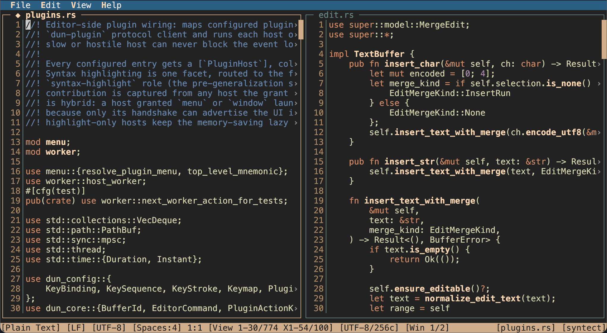
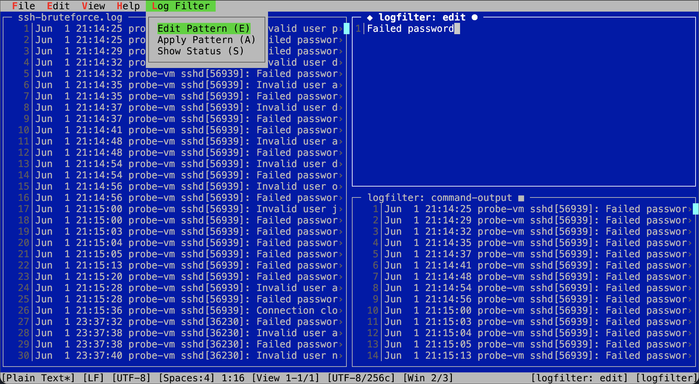
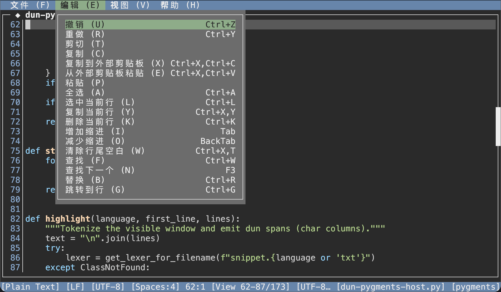
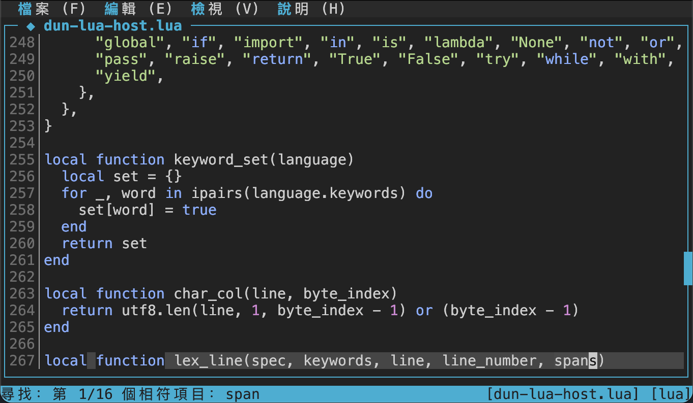

# dun

A terminal text editor for remote operations work. SSH into a host, read and
edit files, capture command output, and keep working on terminals that are
older, narrower, or more conservative than your laptop's.

`dun` is a single binary with no runtime to install beside it, a keyboard-first
interface in the lineage of Microsoft Edit and Turbo Vision, and a hard rule
that it stays under 1 MiB.



```sh
cargo build --release
./target/release/dun notes.txt
```

New here? Start with the **[User Guide](docs/user-guide.md)**.

## Why another editor

Editing over SSH is its own problem. The terminal on the other end may not
speak 256 colors, may render box drawing at the wrong width, may swallow
`Alt`, and may be reached through a KVM that mangles modifiers. The file you
are editing may be a log full of escape sequences, or not be UTF-8 at all. A
half-written save may be the outage.

`dun` treats those as the primary case rather than the degraded one:

- **It fits in the places you have to work.** The release binary is 760 KB on
  Debian x86-64 and 707 KB on macOS, against a hard 1 MiB budget that every
  change is measured against. Copy one file to the host and you are done.
- **It degrades on purpose.** Each theme carries 256-color, 16-color, and
  monochrome variants, reached by capability detection or forced by config.
  Box drawing falls back to ASCII. Ambiguous-width glyphs are probed at
  startup, so a `tmux` that draws `◆` double-wide does not shift the layout.
  Every `Alt` binding has a `Ctrl+X` chord that always arrives.
- **It will not corrupt your file.** Saves go through a same-directory
  temporary file and an atomic rename. A file that changed on disk since it
  was opened is not silently overwritten. A file that is not valid UTF-8 opens
  read-only and escaped rather than being decoded lossily.
- **It will not let a file reprogram your terminal.** Buffer text, file names,
  and status fields are sanitized before rendering — including the Unicode
  bidirectional overrides behind Trojan Source (CVE-2021-42574) and the
  zero-width and tag characters that hide text inside identifiers. They render
  as `<U+202E>` rather than acting.

## What it does

A tiling workspace, not tabs: split with `Ctrl+X,H` / `Ctrl+X,V`, move focus
with `Ctrl+X,←→↑↓`, and compare two files or two parts of one file side by
side. Buffers are shared, so the same file can be open in several windows.

Ordinary editing with the expected shape — undo grouped into sensible
transactions, word-wise movement and deletion, selection by keyboard,
line operations, bookmarks, visible whitespace, word wrap that scrolls and
selects by visual row.

Find and replace with `/i`, `/c`, `/w` flags, live match preview, an
interactive replace, a `replace all` that lands in one undo transaction, and a
read-only Search Results list you can jump from.

`Ctrl+X,S` suspends to a shell, Turbo Pascal style. `Ctrl+X,O` runs one command
and captures stdout and stderr into a read-only pane with a byte cap and a
timeout — useful for pulling a log into the editor without leaving it.

`Ctrl+P` opens a command prompt with Tab completion over every one of the 91
command ids, so anything bindable is also runnable by name.

Ten interface languages ship as external catalogs — `de`, `es`, `fr`, `it`,
`ja`, `ko`, `pt`, `ru`, `zh-Hans`, `zh-Hant` — with English compiled in as the
fallback. They cost the binary nothing.

## A closer look

**Filtering a log with a plugin.** The raw log on the left, the filter pattern
in a scratch window `dun` owns and the plugin reads, and the matching lines in
a window the plugin writes into. The `Log Filter` menu is contributed by the
plugin over the protocol, mnemonics and all.



**Ten interface languages, and four themes.** Menu mnemonics stay English
letters whatever the language, so a translation cannot break a keybinding —
`(U)` is still `(U)` under 撤销. Syntax highlighting here comes from the
Pygments host.





## Plugins

Plugins are **separate programs**, not shared libraries. `dun` launches a host
and speaks a small JSON protocol over its stdin and stdout; the host never
enters the editor's address space and reaches only what the protocol exposes. A
plugin declares *roles*, and a role is a named bundle of capabilities: what it
may read, what it may draw into, whether it may contribute a menu or own a
window. The trust class in your config decides which roles may be granted at
all, every result is validated before it is applied, and a host that hangs,
crashes, or returns nonsense is dropped with a status message.

Reference hosts live in [hosts/](hosts/): syntax highlighting via syntect
(Rust), Pygments (Python), and a dependency-free Lua host, plus log-filter
hosts in Python and Lua. Installing one is unpacking a folder; a plugin's own
settings live with the plugin, not in `dun`'s config.

- Writing one: [docs/plugin-authoring.md](docs/plugin-authoring.md)
- The wire protocol: [docs/plugin-protocol.md](docs/plugin-protocol.md)

## Themes

The default `dun` theme takes its name literally: *dun* is the dull greyish-
brown of a horse's coat, so the palette is pale sand text and a buckskin accent
on deep shadow. (xterm-256 has no dark brown at all — the color cube steps each
channel 0 → 95 with nothing between — so the warmth is carried by the ink
rather than the ground.) It is built as a landscape: the menu bar is sky with
cloud-white labels, the status bar is the buckskin earth, and an unfocused
window recedes into cool haze while the focused one stands in sunlight, so the
warm/cool split carries focus rather than merely decorating.

Also built in: `msedit` (Microsoft Edit blue chrome), `dark` (neutral, cyan
accent), and `turbo` (Borland Turbo Vision, pinned to fixed 256-color indices
so it does not inherit the terminal's palette). Any individual color can be
overridden with `color.<role>` entries.

## Installing

Rust `1.85` or newer. No system dependencies.

```sh
git clone https://github.com/siqiliu-tsinghua/dun.git
cd dun
cargo build --release
```

`scripts/release-build.sh` produces the smaller binary the size budget is
measured against, by rebuilding the standard library; it needs the `rust-src`
component. The ordinary `cargo build --release` is what most people want.

Supported platforms: Linux, macOS, FreeBSD, and Solaris on x86-64. The test
suite runs on all four.

## Documentation

**For users and plugin authors**

- [docs/user-guide.md](docs/user-guide.md) — installing, editing, windows,
  search, running commands, clipboard over SSH, terminal fallbacks, languages,
  troubleshooting.
- [docs/configuration.md](docs/configuration.md) — every configuration key.
- [docs/plugin-authoring.md](docs/plugin-authoring.md) — writing a plugin host.
- [docs/plugin-protocol.md](docs/plugin-protocol.md) — the protocol
  specification: transport, trust classes, capability model.
- [docs/i18n.md](docs/i18n.md) — how translation works, and how to contribute
  or correct a catalog.

**For contributors**

- [CONTRIBUTING.md](CONTRIBUTING.md) — the gate, and the constraints that will
  surprise you.
- [AGENTS.md](AGENTS.md) — contribution rules and project invariants. Read this
  before changing behavior.
- [CLAUDE.md](CLAUDE.md) — orientation and the live working plan.
- [docs/dev/](docs/dev/) — architecture, the size budget and its measurements,
  the test harness and its VMs, terminal compatibility, and the development
  record.

## Design boundaries

`dun` is not a GUI editor, an IDE, a native dynamic-library plugin host, a
shell automation environment, an embedded terminal emulator, or a log-analysis
engine. It does not aim to replace `vim`, `emacs`, or `less` in every workflow.

The 1 MiB budget is the binding constraint behind most of these lines. Features
are admitted or removed against measured bytes; the rationale for what was cut
and why is recorded in [docs/dev/feature-triage.md](docs/dev/feature-triage.md).

## Security

Report vulnerabilities privately through GitHub's Security tab — see
[SECURITY.md](SECURITY.md) for what is in scope and what is not.

## License

MIT. See [LICENSE](LICENSE).
